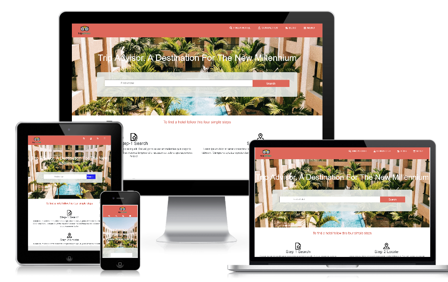

# Online hotel directory

> This is a capstone project for the [Microverse](https://www.microverse.org) module HTML/CSS. It is a hotel directory website built using HTML, CSS3, Bootstrap, and Font awesome.

## Watch a video presentation of the project [here](https://www.loom.com/share/c38f42ac4f94435da8f01fb6c11457c4). The website is built using this [mockup](https://www.behance.net/gallery/25563385/PatashuleKE)

## Website Screenshot

The project is built using HTML and CSS with an extensive use of the grid and flex propreties.

## Built With

- HTML
- CSS3
- Bootstrap
- Font awesome icons
- Webhint/Stylelint linters
- NPM scripts for testing

## Live Demo

[Live Demo ](https://raw.githack.com/RICKCOYL/Directory-of-Schools/development/index.html)

## To get a local copy up and running follow these simple example steps.

### Setup

Clone the project locally.

### Linters

1. run `npm install`.
2. run `npm run test` to check the HTML and CSS files.

### Deployment

Install and run a live server plugin on you IDE/Text editor and run it from the root directory.

## Author

👤 **Rick Oburu**

- Github: [@RICKCOYL](https://github.com/RICKCOYL)
- Twitter: [@rickcoyl](https://twitter.com/Rickcoyl)
- Linkedin: [rick-oburu](https://www.linkedin.com/in/rick-oburu-8627591a4/)

## Show your support

Give a ⭐️ if you like this project!
